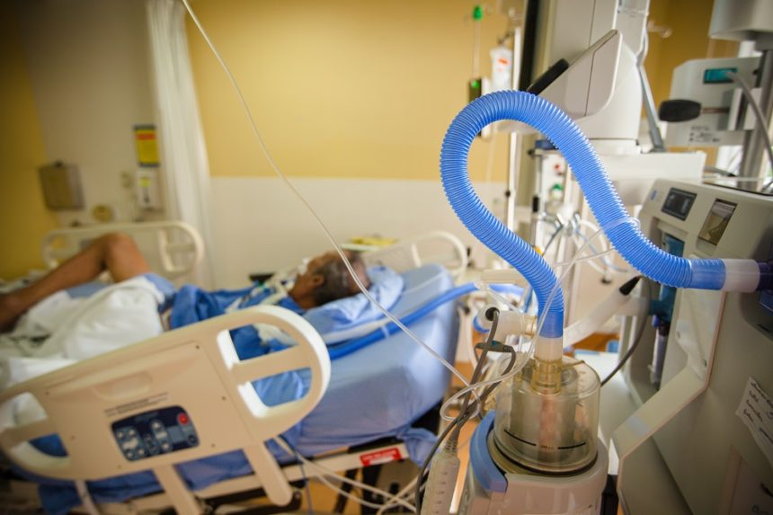

**+++
author = "Shiv Mehrotra-Varma"
title = "Project: Longitudinal Prediction of the Need for Invasive Mechanical Ventilation in Hospitalized Patients with COVID-19 Infection Using Predictive Modeling"
date = "2022-06-27"
description = "This post describes a Python project predicting a patient's need for invasive mechanical ventilation using machine learning techniques."
tags = [
    "Research Project"
]
+++

A research poster expressing my findings and a thorough analysis of what I discovered is accessible [Here](Poster2.pdf).

Project Introduction: 
The COVID-19 pandemic continues to be a major cause of disease and death across the globe, resulting in tremendous strain on hospital resources. Patients with COVID-19 infection can rapidly develop respiratory distress, and over one-third of patients requiring intubation and ventilator therapy progress to multi-organ failure and death (Lim et al., 2021). The SARS-CoV-2 pandemic has also been a logistical nightmare in resource management, and it has become imperative to effectively allocate ICU beds, staff and ventilators. Thus, there is an urgent need for the health care team at any hospital to accurately predict which patients are at risk for requiring Invasive Mechanical Ventilation (IMV), so that active measures can be taken to ameliorate negative outcomes. Clinical experience and past studies have shown that the timing of treatment has a profound effect on disease outcomes by mitigating the cytokine storm and preventing the development of acute respiratory distress syndrome (Gupta et al., 2021). Previous studies have also demonstrated an increase in leukocyte and neutrophil counts to be associated with severe SARS-CoV-2 infection. ACE2 receptors on the pulmonary epithelium serve as entry receptors for the SARS CoV-2 virus. Pulmonary infiltration of neutrophils, with subsequent degranulation and production of interleukin-2 and cytokines, results in widespread organ damage and death. Once the cytokine storm ensues, destruction of pulmonary alveolar integrity spirals into failure of adequate oxygenation and results in the need for mechanical ventilation (Gibson et al., 2020). This project aims to develop a neural network and Random Forest algorithm to predict the need for progression to IMV in patients by analyzing routinely collected laboratory data and comorbidities upon initial presentation to the emergency room at Stony Brook Hospital, New York to support clinical decision-making. The primary goal is to provide a way to identify high risk patients for early administration of dexamethasone and antiviral drugs such as remdesivir, which may ameliorate disease progression and reduce morbidity and mortality. Expensive therapies that specifically target SARS-CoV-2, such as convalescent plasma, sotrovimab, and monoclonal antibodies can be directed to patients with poor disease trajectories to mitigate an aggressive course and prevent long-term complications.

**
